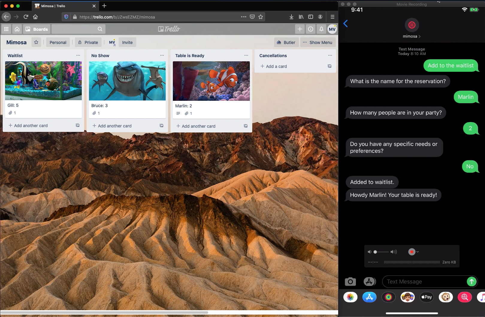

# mimosa- Managing a Wait List using Twilio and Trello

This is an ongoing project I'm building on my Twitch stream. The inspiration is to provide an open-source, easy to use, system for managing wait lists for businesses.

You can follow along every Tuesday and Thursday AM on my Twitch channel where I livestream adding more features: [Twitch- matty_v_codes](https://www.twitch.tv/matty_v_codes)

The objective of the system is to:

- Allow customers to use SMS to signup, cancel, and get their position on the waitlist.
- Businesses can easily manage the waitlist and send relevant updates to the the customer when it's their turn.
- Make the whole system easy to deploy

Here is a screenshot of what the final product could look like using my favorite fish friends from Finding Nemo!



Each week I'll update the code with what's been accomplished so far, so check back for updates!

## Prerequisites

Before getting started you will need the following to complete the setup of the app:

- A Twilio account. If you don't have an account already you can sign up with [this link](www.twilio.com/referral/J5x4pK) for a free $10 to get started (more than enough for this app!)
- A Trello account. You will need to have a Trello Gold account to support some of the functionality we're using here. You can create your Trello account with [here](https://trello.com/matthewvielkind/recommend).
- Download and install the [Twilio CLI](https://www.twilio.com/docs/twilio-cli/quickstart) and [Autopilot Plugin](https://www.twilio.com/docs/autopilot/twilio-autopilot-cli). We'll use this to help deploy some of our Twilio resources. The [Twilio CLI Quickstart](https://www.twilio.com/docs/twilio-cli/quickstart) has fantastic instructions for installing and setting up the CLI. Those instructions are also summarized in the [Setting up the Twilio CLI](#setting-up-the-twilio-cli) section of this documentation.
- Have [ngrok](https://ngrok.com/) installed.

## Setting up the Twilio CLI

Twilio Autopilot will handle your customer interactions. With Autopilot you can define all the different actions your bot will perform.
To deploy the bot we're going to use the [Twilio CLI](https://www.twilio.com/docs/twilio-cli/quickstart) that provides the ability to manage your bots from the commandline a snap.

If you don't have the Twilio CLI installed already on a Mac you can install it through HomeBrew:

```bash
brew tap twilio/brew && brew install twilio
```

On Windows you can install the Twilio CLI through Node. Make sure you have Node version 10.12 or above and enter the following command. Otherwise you will have to update your
version of Node before proceeding.

```bash
npm install twilio-cli -g
```

Once you have installed the Twilio CLI you can login with your Twilio credentials you used to populate the `.env` file earlier. Enter the following command:

```bash
twilio login
```

The last step is to install the Autopilot plugin that will give you the ability to manage your Autopilot bots.

```bash
twilio plugins:install @dabblelab/plugin-autopilot
```

You can test the install with the following command:

```bash
twilio autopilot
```

## Quick Deploy

After setting up your Trello and Twilio accounts the app can be deployed largely through the terminal. Make sure you have cloned the `mimosa` repo. Open a terminal window and make sure your working directory is in the `mimosa` directory.

To setup the app you will:

- Add your account information to the `.env` file
- Start the ngrok server
- Create the Autopilot bot
- Run the `deploy` script to setup Trello and Twilio resources
- Setup the Card Rules / Buttons on your Trello Board

### Setup your Environment File

Create a `.env` file in the project directory.  You can use `.env.sample` as a template for what needs to be provided in the `.env` file.

You will need to provide information about both your Trello and Twilio accounts so that you can access the APIs.

For Twilio you are going to need the `TWILIO_ACCOUNT_SID` and `TWILIO_AUTH_TOKEN`associated with your account. You can find these values in the upper right corner on the main page of the Twilio console. Copy these values into your `.env` file.

Next, you need to purchase a Twilio phone number that customers can text. From the console select "Phone Numbers" from the menu of services
on the left. Make sure you choose a phone number with texting capability!

Once you have purchased your phone number enter the phone number in the [E.164 format](https://www.twilio.com/docs/glossary/what-e164) (i.e. +14155552671 format) in the `TWILIO_FROM_NUMBER` option in the `.env` file. Also, find the SID for your phone number and enter it in the `TWILIO_PHONE_NUMBER_SID` option in `.env`.

Next, you need to setup the Trello variables in `.env` so that you can access the Trello API. Follow the [Trello API Introduction](https://developer.atlassian.com/cloud/trello/guides/rest-api/api-introduction/) to generate your API key and API Token.

Once you have your Trello API Key and API Token you can populate `TRELLO_API_KEY` and `TRELLO_TOKEN` in the `.env` file.

### Setting up ngrok

For testing and development we're going to use [ngrok](https://ngrok.com/) to connect our Autopilot bot to the internet.

If you don't have ngrok installed you can download it for free from their website.

Once ngrok is installed run the following from the Terminal to start ngrok.

```bash
ngrok http 5000
```

You will see a HTTPS forwarding address. Keep that handy as you'll need that in the upcoming steps.

### Building the Twilio Autopilot Bot

We're going to use [Twilio Autopilot](https://www.twilio.com/autopilot) to build a bot to process customer messages. Autopilot will interpret customer messages and direct them to the correct task they request.
 
The project contains a file `schema_template.json` defining the behavior of the Autopilot bot. The JSON file has details about  Throughout the template there are placeholders for the appropriate ngrok address to make sure requests get forwarded to the correct location to be processed. Instead of having to replace these instances with your own ngrok address there is a function in `assets.py` called `update_autopilot_endpoints`
that will make those replacements and generate a new schema file you can use for deployment. You can call this through a terminal call replaying NGROK_URL with the HTTPS forwarding address of your ngrok server.

```commandline
python3 assets.py update-autopilot-endpoints NGROK_URL
```

The output is a new file `schema.json` that has the correct ngrok address. You can now use `schema.json` to create your Autopilot bot using the Twilio CLI.

In the commandline enter:

```commandline
twilio autopilot:create --schema schema.json
```

The command will create your Autopilot bot according the schema defined in your JSON file. If you already have an existing bot and would just like to update the bot you can enter:

```commandline
twilio autopilot:update --schema schema.json
```

After creating the Autopilot bot you need to get the SID identifying the bot and add it to your `.env` file. From the commandline enter the following command to get a list of your Autopilot bots.

```commandline
twilio autopilot:list
```

Find your Autopilot bot from the list and column containing the SID. Copy the SID and paste it in your `.env` file for the `TWILIO_AUTOPILOT_SID` value.

### Run Script to Create Trello Board and Other Twilio Services

Now the Trello assets and the remaining Twilio assets need to be setup. The setup for all these assets is completed through a single commandline call `deploy`.  The `deploy` function will:

- Create a new Trello board
- Create lists in the Trello board
- Create custom labels on the Trello board
- Enable the Custom Fields Power-Up on the board (NOTE: this step will fail if you don't have at least a Trello Gold account)
- Create Custom Fields for customer name and phone number
- Setup a Twilio Sync Map Service for mapping customer phone numbers to their Trello card
- Build a Twilio Studio Flow to manage different workflows
- Connect the Twilio Studio Flow to your phone number

All of the above is done through one commandline call where you have to provide a name for the Trello board and the ngrok URL:

```commandline
python3 assets.py deploy "Board Name" NGROK_URL
```

Now if you log into your Trello account you should see your board created with all of the lists included.

### Setup Buttons and Card Rules

The last step is to setup the Trello Card Buttons and Card Rules. Unlike the previous steps that were packaged into command line scripts these have to be setup manually using Trello's Butler feature. Butler allows you to set up board automation tasks and other board functionality including capturing card movements and creating card buttons.

Log into your Trello account and find the board you created in the previous step. Click the **Butler** button in the upper right corner.

Click **Rules** from the menu on the left. Our board is going to need to capture two different actions as cards are moved around.

#### Rule 1: Send Message When Table is Ready
The first rule captures when a card is dragged from **Wait List** to the **Table is Ready** list. When this happens we want to trigger a text message to be sent to the customer alerting them the
table is ready.

Click **Create Rule** and then **+ Add Trigger**.

Under **Select Trigger** choose **Card Move**.

In the second box select **moved into** then **Table is Ready** and finally **by anyone** then click the green **+** sign to create the trigger.

Next the action for when the trigger executes needs to be defined.

Under **Select an Action** choose **Content**.

Scroll to the bottom where you can define a HTTP request.

Select the **post to** option. As the URL enter `NGROK_URL/table-is-ready` substituting your ngrok URL.

Finally enter the following into the payload:

```text
{"name": "{{%name}}", "phone_number": "{{%phone_number}}"}
```

The payload will send the customer name and phone number entered into the fields of the customer card to our endpoint so that a more personal message can be sent to the customer.

#### Rule 2: Remove Customer from Board
The second rule captures when a card is removed from the board. When this happens we want to make sure the customer is also removed rom the Twilio Sync Map to avoid any future conflicts.

Click **Create Rule** and then **+ Add Trigger**.

Under **Select Trigger** choose **Card Move**.

We're going to capture when a card is archived. Go to the third box and select the options so that it reads:

"when a card is **archived** by **anyone**"

Click the green **+** sign to create the trigger.

Similar to before the action will be another HTTP request.

Under **Select an Action** choose **Content**.

Scroll to the bottom where you can define a HTTP request.

Select the **post to** option. As the URL enter `NGROK_URL/remove-sync-map-entry` substituting your ngrok URL.

Finally enter the following into the payload:

```text
{"phone_number": "{{%phone_number}}"}
```

In this rule we only need the phone number in the payload to delete the entry.

#### Button 1: Table Reminder

Card Buttons can be added to our Cards to provide the user with access to quick functionality. Customers don't always come when their table is ready, so the first button
we're going to add will send follow-up reminders if the customer's table is ready and they haven't shown up.

From the **Butler** menu select **Card Button** from the menu on the left.

Click **Create Button**.

Give the button a title, **Table Reminder** and choose an icon for the button then check the box next to **Close card when action performed**.

Click **Add Action**.

Choose the **Content** option and scroll to the bottom to create the HTTP request.

Select the **post to** option. As the URL enter `NGROK_URL/table-reminder` substituting your ngrok URL.

Finally enter the following into the payload:

```text
{"name": "{{%name}}", "phone_number": "{{%phone_number}}"}
```
Now when you open a card on your board there will be a button to quickly send a reminder the customer's table is ready.

#### Button 2: Confirm Phone

The second button is used to handle workflows where the customer is a walk-in. As a business you want to make sure the phone number can be confirmed so that messages about when
their table is ready can be delivered.

From the From the **Butler** menu select **Card Button** from the menu on the left.

Click **Create Button**.

Give the button a title, **Confirm Phone** and choose an icon for the button then check the box next to **Close card when action performed**.

Click **Add Action**.

Choose the **Content** option and scroll to the bottom to create the HTTP request.

Select the **post to** option. As the URL enter `NGROK_URL/confirm-phone` substituting your ngrok URL.

Finally enter the following into the payload:

```text
{"name": "{{%name}}", "phone_number": "{{%phone_number}}", "card_id": "{cardid}"}
```

### Startup the Flask Server

The last step is to start your Flask server by entering the following in the commandline:

```commandline
python3 bot.py
```


